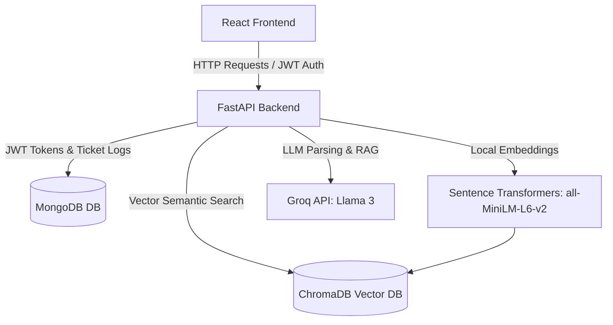

# AegisDesk - LLM-Powered Smart Ticket Automation & Helpdesk System

AegisDesk is an enterprise-grade AI helpdesk platform that automatically ingests support complaints in natural language, translates them internally from regional languages (Hindi, Kannada), classifies the category and severity priority, routing them to the correct departments. 

It features semantic duplicate ticket warnings using cosine similarity embeddings (ChromaDB) and Retrieval-Augmented Generation (RAG) to synthesize custom troubleshooting resolutions based on historical records.

---

## Technical Architecture



- **Frontend**: React, Tailwind CSS, Axios, React Router, Recharts.
- **Backend**: Python, FastAPI.
- **AI Engine**: Groq API (using `llama3-8b-8192`), Sentence Transformers (`all-MiniLM-L6-v2`).
- **Database**: MongoDB (persistence) + ChromaDB (vector indexing).

---

## Features Built-In

1. **Multi-lingual Translation**: Submissions in English, Hindi (*"मेरा वीपीएन नहीं चल रहा"*), or Kannada are auto-detected and translated internally to English.
2. **Strict JSON Parsing**: AI parses complaints and structures them into exact fields: `title`, `summary`, `category`, `subcategory`, `priority`, `department`, `tags`, `reasoning`, `suggested_solution`.
3. **Cos-Similarity Duplicate Alert**: Generates a warning alert if a ticket's embedding cosine similarity exceeds `75.0%` with a previously filed ticket. Exposes a one-click administrative merge workflow.
4. **LangChain RAG Synthesis**: Queries ChromaDB for similar resolved complaints and feeds their solutions to Llama 3 to formulate custom troubleshooting recommendations.
5. **Admin Dashboards & Charts**: Renders priority breakdown, category distribution, SLA risk levels, and sentiment percentages using Recharts.

---

## Project Folder Structure

```text
llm_project/
├── backend/
│   ├── app/
│   │   ├── auth/          # JWT password authentication helper dependencies
│   │   ├── database/      # MongoDB Async Motor client
│   │   ├── llm/           # Groq Llama 3 prompts & heuristics parser
│   │   ├── models/        # Pydantic schemas (Request/Response validation)
│   │   ├── rag/           # ChromaDB client & Sentence Transformers
│   │   ├── routes/        # Router bindings (auth, tickets, analytics)
│   │   ├── services/      # Ingestion pipeline logic orchestrator
│   │   └── main.py        # FastAPI initialization and auto-seeding
│   ├── requirements.txt   # Backend python packages
│   └── .env               # Backend configurations
├── frontend/
│   ├── src/
│   │   ├── components/    # Reusable layouts (Navbar)
│   │   ├── context/       # Auth JWT login provider
│   │   ├── pages/         # Login, Register, Dashboard, Details, Analytics
│   │   ├── services/      # Axios API handler client
│   │   ├── App.jsx        # Routing bindings and Auth guards
│   │   ├── index.css      # Custom scrollbars, glows, and tailwind rules
│   │   └── main.jsx       # Mounting anchor script
│   ├── package.json       # Node package manager configurations
│   ├── vite.config.js     # React compilation port mappings
│   ├── tailwind.config.js # Branding color specs
│   └── postcss.config.js  # Styling processor configs
└── README.md              # Documentation manual
```

---

## Out-Of-The-Box Robustness (Fallbacks)

To allow developers to run, inspect, and evaluate the application instantly:
1. **No local MongoDB?**: Connection failures trigger an **Async In-Memory Mock Database** that emulates async Mongo queries (`find`, `insert_one`, `update_one`, `count_documents`, `aggregate`).
2. **No Groq API Key?**: If `GROQ_API_KEY` is not provided in `.env`, the system activates a **Semantic Heuristic Parser**. It parses keywords, maps them to categories/departments, and constructs structured responses.
3. **Missing Sentence Transformers/ChromaDB?**: Falls back to Jaccard word-overlap and TF-IDF vectors to compute duplicate similarity percentages.
4. **Auto-Seeding**: On first run, the database automatically seeds **5 resolved historical tickets** (VPN gateway timeouts, payroll portal crashes, database latency, authentication lockouts, router outages) into MongoDB and ChromaDB.

---

## Production Deployment

See **[DEPLOYMENT.md](./DEPLOYMENT.md)** for Render (backend) + Vercel (frontend) setup, environment variables, and checklists.

---

## How to Set Up & Run

### Prerequisites
- Python 3.8+ installed on your computer.
- Node.js (with npm) installed on your computer.
- *(Optional)* MongoDB running locally on port `27017` (if not running, mock database activates automatically).

---

### Step 1: Running the FastAPI Backend

1. Navigate to the backend directory:
   ```powershell
   cd backend
   ```

2. Create a virtual environment (optional but recommended):
   ```powershell
   python -m venv venv
   # On Windows:
   venv\Scripts\Activate.ps1
   # On macOS/Linux:
   source venv/bin/activate
   ```

3. Install python requirements:
   ```powershell
   pip install -r requirements.txt
   ```

4. Configure the environment variables in `.env`:
   - If you have a Groq key, change `GROQ_API_KEY` to your key:
     `GROQ_API_KEY=gsk_xxx`
   - If not, keep the placeholder; the heuristic fallback will take over.

5. Boot the FastAPI web server using Uvicorn:
   ```powershell
   uvicorn app.main:app --reload --port 8000
   ```
   *The backend will boot on `http://localhost:8000`. You can inspect the interactive OpenAPI documentation at `http://localhost:8000/docs`.*

---

### Step 2: Running the React Frontend

1. Open a new terminal and navigate to the frontend directory:
   ```powershell
   cd frontend
   ```

2. Install Node dependencies:
   ```powershell
   npm install
   ```

3. Boot the Vite development server:
   ```powershell
   npm run dev
   ```
   *The frontend will boot on `http://localhost:5173`. Open your web browser and go to `http://localhost:5173` to test the app.*

---

## Testing Guide

### A. Logging In
When you open `http://localhost:5173`, the system auto-seeds two default accounts:
- **IT Support Admin Account**:
  - **Email**: `admin@helpdesk.com`
  - **Password**: `admin123`
- **Standard Employee Account**:
  - **Email**: `employee@helpdesk.com`
  - **Password**: `employee123`

---

### B. Sample Ticket Scenarios to Test

#### Scenario 1: Multi-language Support (Hindi)
1. Log in as **Employee** (`employee@helpdesk.com` / `employee123`).
2. Input the following Hindi complaint:
   `मेरा वीपीएन कनेक्ट नहीं हो रहा है, काम रुक गया है`
3. Hit submit.
4. **AI Process**: The AI will detect language is Hindi, translate it, categorize it as "Network Issue", assign priority "High" and route it to "Network Operations".
5. Click on the ticket. Notice how the detail displays the English translation side-by-side.

#### Scenario 2: Duplicate Ticket Check
1. Log in as **Employee**.
2. Submit a ticket describing a VPN outage:
   `I am unable to connect to the office VPN network. It says Gateway timeout error 504 and keeps disconnecting.`
3. **AI Process**: This ticket matches one of our pre-seeded tickets. Go to the dashboard. You will see a blinking **"DUPLICATE ALERT"** badge.
4. Log in as **Admin** (`admin@helpdesk.com` / `admin123`).
5. Open the ticket details. Under the "Duplicate Alert" card on the right, see the match similarity (e.g. 85%).
6. Click **"Merge & Close"** to resolve the ticket as a duplicate, logging it automatically.

#### Scenario 3: RAG Solution Suggestions
1. Log in as **Employee** or **Admin**.
2. Submit a complaint regarding database slow-downs:
   `Database query timeouts are causing loading screens to freeze on the client dashboard page.`
3. Open the ticket details page. Inspect the **"AI Suggested Solution (RAG Synthesized)"**. The engine retrieves the past resolved ticket about indexes and query optimizations from ChromaDB, creating a matching resolution!


<h1>demo vedio</h1>
<vedio src ="https://drive.google.com/file/d/16pMyDTIw8wisl9bzqJPmu-mRGETcCdov/view?usp=sharing" control autoplay width="50%" height="50%>
